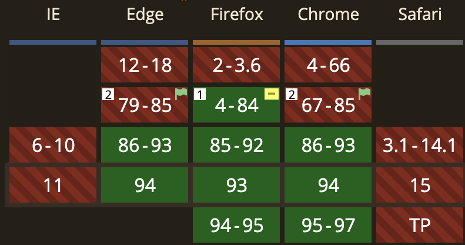

import { RadioButtonWithVisasqLiteStyle, StopPropagationDiv } from '../scripts/components'
import {
  DemoOfRadioButtonsWithDefaultStyle,
  DemoOfRadioButtonsWithCustomizedStyle,
  DemoOfTextFieldWithDefaultStyle,
  DemoOfTextFieldWithCustomizedStyle,
  DemoOfRadioButtonsWithVisasqLiteStyle,
} from '../scripts/demo'

## `:focus-visible` とは？

 

- キー操作時のみスタイルを当てるための疑似クラス

 
<StopPropagationDiv>
  <DemoOfRadioButtonsWithDefaultStyle />
</StopPropagationDiv>
 

- Chrome では 2020/10 から使えるようになった

  
  <a href="https://caniuse.com/css-focus-visible">https://caniuse.com/css-focus-visible</a>

---

## `:focus-visible` のデモ

 
<StopPropagationDiv>
  <DemoOfRadioButtonsWithDefaultStyle />
   
  <DemoOfRadioButtonsWithCustomizedStyle />
   
  <DemoOfTextFieldWithDefaultStyle />
   
  <DemoOfTextFieldWithCustomizedStyle />
   
  <DemoOfRadioButtonsWithVisasqLiteStyle />
</StopPropagationDiv>
