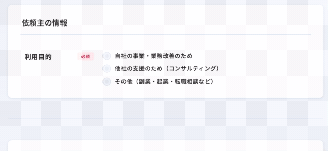

import { RadioButtonWithVisasqLiteStyle } from '../scripts/components'

## JS でもキー操作中であるかわかるか？

<br />

`document.querySelector()` で<br />
`:focus-visible` な要素を取得することができる<br />
<br />
<br />
以下のようにしてキー操作中であるかがわかる:

```javascript
const hasFocusVisible = () => {
  try {
    return !!document.querySelector(':focus-visible');
  } catch {
    // :focus-visible 非対応ブラウザ
    return false;
  }
};
```

---

## ユースケース
- <RadioButtonWithVisasqLiteStyle className="inline-block" />をクリックしたら、次に入力すべき入力欄にフォーカスが移る
- キー操作で <RadioButtonWithVisasqLiteStyle className="inline-block" />を選択するときは、入力欄にフォーカスが移らない

<p class="p-visasq-issue-new">
  
  <a href="https://service.visasq.com/issues/new/edit">ビザスクlite 公募案件作成画面</a>
</p>
